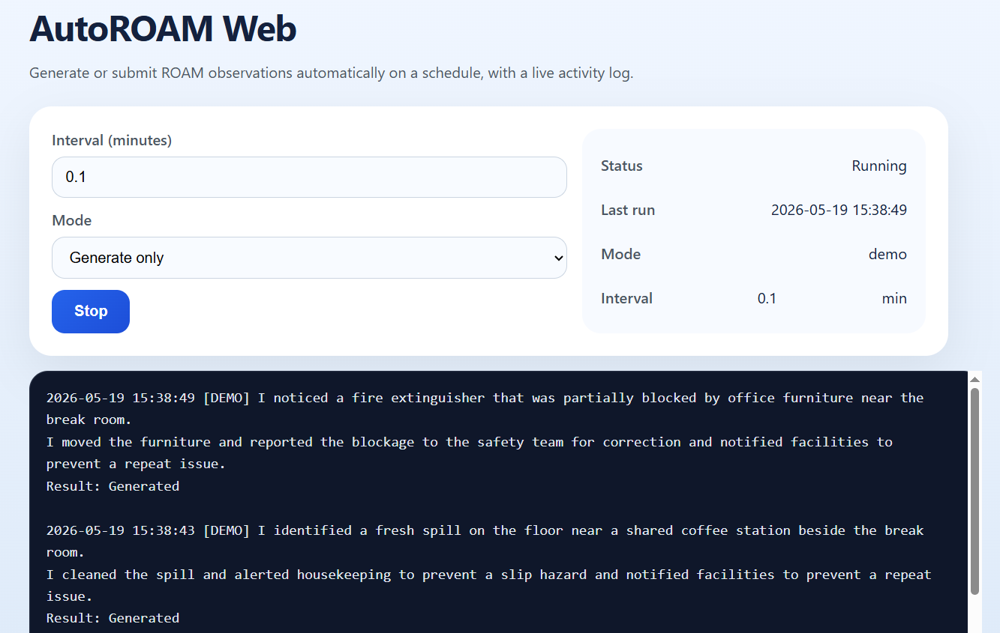

# Project Overview

At my company, one of the performance metrics involves logging weekly safety observations—called **ROAM Observations**. Employees submit these through a simple web form, describing safety concerns and the actions taken to address them.

The process was repetitive and time‑consuming, so I built a tool to automate the generation and optional submission of those entries.

---

## How It’s Made

### Tech Stack: **Python**, **Flask**, **Selenium WebDriver**

### What It Does
The application helps create realistic office safety observations and corrective actions, then either previews them or submits them through the ROAM web form.

- Uses a Flask-based web frontend for control and logging
- Generates contextual safety observations for common office hazards
  - Example: “I identified a desk lamp cord stretched across a shared workstation beside the open-plan office.”
  - Uses structured location/hazard/action templates for plausible outputs
- Generates a matching action for each observation
- Provides a browser UI to start and stop periodic generation
- Supports two modes:
  - `demo` — generate only, no form submission
  - `submit` — post generated entries to ROAM via Selenium
- Shows a live activity log in the browser
- Keeps the log panel at a fixed height with scroll support so the browser stays usable

---

## Usage

1. Activate your Python environment.
2. Run `python app.py`.
3. Open `http://127.0.0.1:5000` in your browser.
4. Set the generation interval and choose `Generate only` or `Submit to ROAM`.
   - Spacing entries out makes generated ROAM logs appear more natural and avoids obvious batch logging patterns.
   - A `demo` mode was also added so the tool can be tested safely without uploading anything.
5. Click `Start` to begin periodic generation, and `Stop` to pause it.

---

## Notes

- The UI limits log rendering to the most recent entries, while older logs are still accessible through the app state.
- The generator is designed for office safety observations and corrective actions, not general-purpose text generation.
